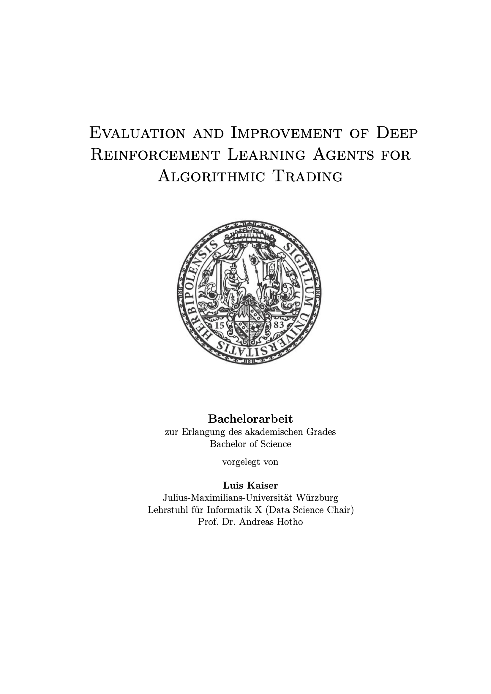

# Bachelor Thesis

This repository contains the [LaTex source code](latex), the [Python code](code), Docker files, [kubernetes scripts](cluster) and the [dataset](dataset.csv) for my Bachelor 
Thesis in CS at the University of Wuerzburg, Data Science Lab, supervised by Prof. Hotho:  
"Evaluation and Improvement of Deep Reinforcement Learning Agents for Algorithmic Trading".

### Abstract 

In recent years, several variants of deep reinforcement learning 
(DRL) have become state-of-the-art for learning optimal strategies in Algorithmic Trading. 
This has led to a great interest in the financial sector to explore
the use and benefits of various existing DRL implementations in complex and dynamic 
investment markets in detail. In this paper, a large-scale 
analysis with five DRL variants in a realistic evaluation setting on a comprehensive dataset 
is done to evaluate their performance in different 
market situations for 70 securities. 
The hyperparameters for each composition of DRL variant, security and 
training run are separately optimized using grid search and their influence on the sequential 
decision process are analyzed. In total, the results 
of 2400 experiments (~82,000 CPU core hours) are summarized, providing new 
insights into the performance of DRL approaches in Algorithmic Trading. 
The results show that none of the variants perform significantly 
better than the standard deep q learning (DQL) algorithm and characterize the Long Short-Term Memory (LSTM) 
architecture as an important 
feature in volatile market phases. Extensions to the architecture of some DRL 
algorithms, such as the use of additional market information, 
do not lead to significantly better decision-making in the models used.
Consistent time series prove to be a crucial factor for good performance and show an 
 interaction with the market risk of a security. 
Furthermore, conclusions can be drawn from the effects of the studied hyperparameters 
for their efficient adjustment in different economic phases.

key words: Algorithmic Trading · deep reinforcement learning · evaluation

 
 

    

 

### Acknowledgements
* Copyright (c) 2018 Husein Zolkepli
* Copyright (c) 2020 Hongyang Yang
* Supervisors: Prof. Hotho, Padraig Davidson and Julian Tritscher

### Contact
* [LinkedIn](https://www.linkedin.com/in/luiskaiser/)
* <lkaiser@utexas.edu>
